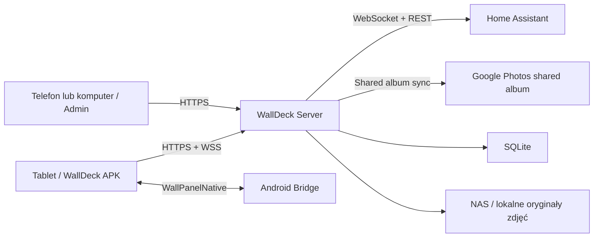

# Plan architektury WallDeck Web

Status: implementacja rozpoczęta — pierwszy widok działa
Data: 2026-09-26

## 1. Cel

WallDeck Web ma być głównym interfejsem panelu ściennego. Home Assistant pozostaje backendem automatyki, APK udostępnia funkcje Androida, a cały wygląd, animacje, ramka zdjęć, multimedia i późniejszy asystent działają w aplikacji WWW hostowanej na homelabie.

Plan rozwija założenia zapisane w [Home Assistant Wall Panel — Redmi Pad 2](https://app.notion.com/p/3e3827a850e38106a208c7b5315919e4). Wake word pozostaje świadomie w późniejszym etapie roadmapy.

## 2. Decyzja technologiczna

| Warstwa | Wybór | Uzasadnienie |
|---|---|---|
| Frontend | React 19 + TypeScript + Vite | duży ekosystem, dobra obsługa długowiecznej SPA w WebView, szybki development bez narzutu SSR |
| Animacje | Motion for React + CSS transforms; opcjonalnie Rive | Motion obsługuje animacje layoutu, gesty i sekwencje; Rive nadaje się do złożonych animacji stanowych asystenta |
| Maszyna trybów | XState | jawne i testowalne przejścia `IDLE`, `ACTIVE`, `MEDIA`, później `ASSISTANT` |
| Dane frontendowe | TanStack Query + cienki klient WebSocket | cache zapytań i odporne odświeżanie danych; zdarzenia HA i urządzenia bez pollingu |
| UI | CSS Modules, CSS custom properties, Radix primitives | własny wygląd bez ciężkiego gotowego dashboardu; dostępne komponenty bazowe |
| Backend | Node.js LTS + TypeScript + Fastify | jeden język dla całego systemu, niewielki narzut i proste API/WebSocket/OAuth |
| Kontrakty | Zod + współdzielone typy TypeScript | walidacja każdej wiadomości na granicy procesu i zgodność klient–serwer |
| Baza | SQLite + Drizzle ORM | wystarczające dla jednego homelabu, prosty backup i migracje bez osobnej usługi |
| Obrazy | lokalny magazyn / NAS | oryginały zdjęć lokalnie; optymalizację dodamy tylko wtedy, gdy testy wykażą potrzebę |
| Testy | Vitest + Testing Library + Playwright | logika jednostkowa, komponenty oraz pełne scenariusze trybów i WebView |
| Uruchomienie | Docker Compose + Caddy | powtarzalny deployment i HTTPS za reverse proxy |

Nie wybieramy Next.js ani innego frameworka SSR. Panel nie potrzebuje SEO, a podstawowym klientem jest jeden WebView. Zwykła SPA jest prostsza, mniejsza i łatwiejsza do utrzymania offline.

## 3. Docelowy układ repozytorium

```text
apps/web-panel/
├── apps/
│   ├── client/                 React/Vite — panel i panel administracyjny
│   └── server/                 Fastify — API, WebSocket i integracje
├── packages/
│   ├── contracts/              schematy Zod i wersjonowany protokół
│   ├── ui/                     design tokens i wspólne komponenty
│   └── integrations/           typy adapterów HA, Photos i Android
├── storage/                    ignorowane dane runtime
├── docker-compose.yml
└── README.md
```

Monorepo użyje `pnpm workspaces`. Nie dokładamy Turborepo na początku; liczba pakietów nie uzasadnia jeszcze dodatkowej warstwy.

## 4. Architektura wykonawcza



Frontend nie łączy się bezpośrednio z Home Assistant ani Google. Wszystkie tokeny i reguły dostępu pozostają na serwerze. Tablet otrzymuje tylko dane potrzebne do aktualnego widoku.

### Procesy

**Client** jest jedną aplikacją z dwoma powłokami:

- `/panel` — pełnoekranowy interfejs tabletu;
- `/admin` — konfiguracja dostępna z normalnej przeglądarki na telefonie lub komputerze.

**Server** zapewnia:

- uwierzytelnienie urządzenia przez Device ID + podpis challenge;
- sesję panelu w Secure/HttpOnly cookie;
- adapter Home Assistant;
- adapter `GooglePhotosSharedAlbumSource` za interfejsem `PhotoSource`;
- lokalny katalog oryginałów zdjęć i manifest synchronizacji;
- konfigurację trybów, ekranów i urządzeń;
- wersjonowany WebSocket;
- healthcheck, logi i migracje bazy.

## 5. Model stanu interfejsu

Centralna maszyna XState zarządza trybami, zamiast rozrzucać warunki po komponentach:

```text
BOOT
├── CONNECTING
├── ON_WALL_IDLE       zdjęcia, zegar, pogoda, wybrane sensory
├── ON_WALL_ACTIVE     sterowanie domem i szybkie akcje
├── MEDIA              YouTube / Spotify w późniejszym etapie
├── ASSISTANT          późniejszy etap wake word
├── OFFLINE            ostatni stan i dane z cache
└── ERROR              kontrolowany ekran diagnostyczny
```

`OFF_WALL` pozostaje przede wszystkim stanem natywnej aplikacji Android: Activity zostaje zakończone i tablet wraca do poprzedniej aplikacji. WebPanel może otrzymać `powerDisconnected` do zapisania ostatniego stanu, ale nie może polegać na tym, że zdąży wykonać dłuższą operację.

Źródła przejść:

- eventy Android Bridge: zasilanie, bateria, później czujniki;
- zdarzenia Home Assistant: obecność/mmWave, alarm, dzwonek i stan domu;
- dotyk oraz bezczynność użytkownika;
- harmonogram dnia/nocy;
- później wake word i odtwarzanie multimediów.

## 6. Strategia animacji

Animacje są elementem produktu, ale muszą utrzymywać 60 fps na docelowym tablecie.

### Zasady

- animujemy głównie `transform` i `opacity`;
- unikamy ciągłych animacji dużych blurów, cieni i filtrów;
- w MVP zdjęcia są serwowane z NAS w oryginalnej rozdzielczości, a WebView dopasowuje je do ekranu;
- każda zmiana trybu ma jedną koordynowaną sekwencję, sterowaną stanem;
- przerywane przejścia zaczynają się od aktualnej pozycji, bez skoków;
- po dłuższej bezczynności zmniejszamy częstotliwość animacji i liczbę warstw;
- respektujemy `prefers-reduced-motion`, również jako ręczne ustawienie panelu;
- mierzymy frame time, pamięć WebView i czas dekodowania obrazów na fizycznym tablecie.

### Podział narzędzi

- **CSS transitions/keyframes** — puls, halo, proste stany przycisków;
- **Motion** — przejścia ekranów, layout, gesty, spring i shared element transitions;
- **Rive** — opcjonalnie pojedyncza złożona animacja asystenta lub statusu, jeśli statyczne SVG + Motion nie wystarczą;
- **Canvas/WebGL** — tylko dla konkretnego efektu po pomiarze wydajności, nie jako fundament całego UI.

Pierwszy budżet wydajnościowy: brak długich zadań powyżej 50 ms podczas normalnego działania, stabilne 60 fps w przejściach, ograniczony preloading do bieżącego i następnego zdjęcia oraz brak nieograniczonego wzrostu pamięci po 24 godzinach.

## 7. Google Photos — decyzja implementacyjna

**Wymaganie:** użytkownik dodaje zdjęcie wyłącznie do dedykowanego albumu Google Photos. WallDeck sam wykrywa nowy element i zaczyna go wyświetlać bez ręcznego importu.

### Shared album jako źródło MVP

1. Dedykowany album Google Photos ma włączone udostępnianie przez link.
2. Link jest zapisany wyłącznie w konfiguracji WallDeck Server.
3. Synchronizator raz dziennie oraz po użyciu „Synchronizuj teraz” odczytuje stronę albumu.
4. Nowe zdjęcia pobiera w oryginalnej rozdzielczości do lokalnego magazynu / NAS.
5. Manifest przechowuje identyfikator, wymiary, nazwę pliku, czas synchronizacji i stan aktywności.
6. WallDeck Web korzysta wyłącznie z lokalnej kopii po LAN-ie.

Pierwszy test na rzeczywistym albumie odnalazł i pobrał 119 z 119 elementów bez błędów. Powtórne uruchomienie nie pobrało duplikatów.

### Ograniczenie techniczne

Odczyt shared albumu po linku nie jest oficjalnym, stabilnym API Google Photos. Parser zależy od danych osadzonych w stronie i może wymagać poprawki po zmianie formatu Google. Cała zależność pozostaje w adapterze `GooglePhotosSharedAlbumSource`, aby nie wpływała na katalog, API ani slideshow.

Link udostępnionego albumu jest traktowany jak sekret o ograniczonym zakresie: nie trafia do repozytorium, logów ani klienta WebView. Wyłączenie udostępniania w Google Photos unieważnia dostęp.

### Synchronizacja i lokalna kopia

- nowe zdjęcie → pobierz i oznacz jako aktywne;
- zdjęcie nadal obecne → pomiń pobieranie i odśwież `lastSeenAt`;
- brak zdjęcia w albumie → oznacz jako nieaktywne;
- brak lokalnego pliku mimo wpisu w manifeście → pobierz ponownie;
- fizyczne kasowanie nieaktywnych plików nastąpi dopiero po ustalonym okresie ochronnym.

W MVP zapisujemy oryginały. WebPanel używa `fit`/`cover` i preloaduje bieżące oraz następne zdjęcie. Warianty zoptymalizowane dodamy tylko wtedy, gdy testy na tablecie wykażą problemy z RAM-em, dekodowaniem lub płynnością.

## 8. Home Assistant

WallDeck Server utrzymuje jedno połączenie z `/api/websocket`, subskrybuje tylko potrzebne encje i publikuje do klientów znormalizowane zmiany. REST służy do wybranych operacji i diagnostyki. Długotrwały token HA pozostaje wyłącznie na serwerze.

Konfiguracja mapuje encje HA na semantyczne nazwy WallDeck:

```yaml
rooms:
  salon:
    temperature: sensor.salon_temperature
    presence: binary_sensor.salon_presence
    lights:
      - light.salon_main
```

Frontend nie powinien znać przypadkowych `entity_id` w komponentach. Adapter tłumaczy stan HA na kontrakty `RoomState`, `ClimateState`, `LightState` i `HomeStatus`. Dzięki temu zmiana integracji HA nie wymaga przebudowy UI.

## 9. Protokół klient–serwer

WebSocket ma jawne wersjonowanie i schematy Zod:

```text
client.hello
server.snapshot
server.patch
server.modeHint
client.command
server.commandResult
server.error
```

Po ponownym połączeniu klient wysyła ostatni numer rewizji. Serwer zwraca brakujące zmiany albo pełny snapshot. Komendy mają correlation ID, timeout, walidację i idempotency key tam, gdzie powtórzenie mogłoby zmienić urządzenie drugi raz.

## 10. Offline i odporność

- service worker przechowuje wersjonowany app shell;
- IndexedDB przechowuje ostatni poprawny snapshot, ustawienia wizualne oraz kolejkę bezpiecznych akcji UI;
- lokalny magazyn serwera udostępnia przygotowane zdjęcia bez połączenia z Google;
- ekran offline nadal pokazuje zegar, ostatnie zdjęcia i stan połączenia;
- komendy do domu nie są udawane jako wykonane; UI pokazuje stan oczekujący i wynik serwera;
- klient stosuje backoff z jitterem i wraca po WebSocket bez przeładowania całego WebView;
- backend ma `/health/live` i `/health/ready` oraz automatyczne migracje przed startem.

## 11. Bezpieczeństwo

- wyłącznie HTTPS/WSS poza tunelem developerskim localhost;
- Device Key i tokeny OAuth nigdy nie trafiają do JavaScriptu ani repozytorium;
- refresh token Google i token Home Assistant są szyfrowane na serwerze;
- sesje panelu są przypisane do Device ID, krótkie i odnawialne;
- panel Android otrzymuje minimalny zakres API, a `/admin` wymaga osobnej sesji użytkownika;
- restrykcyjny CSP, brak skryptów z przypadkowych CDN i zależności przypięte lockfile;
- proxy zdjęć nie przyjmuje dowolnego URL, tylko znane identyfikatory katalogu;
- wszystkie komendy HA przechodzą przez allowlistę domen, usług i encji;
- logi nie zawierają tokenów, Device Key ani adresów zdjęć Google.

## 12. Obserwowalność i testy

### Automatyczne

- testy maszyny stanów dla wszystkich przejść i przerwań animacji;
- testy kontraktów Zod oraz zgodności wersji bridge;
- testy adaptera HA na nagranych, zanonimizowanych komunikatach;
- testy parsera shared albumu na syntetycznych fixture'ach bez prywatnych danych;
- Playwright dla `/panel` i `/admin` w rozdzielczości 1280 × 2048 oraz w orientacji poziomej;
- wizualne snapshoty kluczowych ekranów;
- test 24-godzinny pod kątem pamięci, reconnectów i rotacji zdjęć.

### Na tablecie

- stabilność 60 fps i brak thermal throttlingu;
- przejście idle ↔ active po obecności i dotyku;
- utrata homelabu, HA i internetu jako trzy osobne scenariusze;
- restart serwera bez restartu APK;
- dock/undock podczas animacji i odtwarzania zdjęcia;
- działanie po wygaszeniu oraz ponownym włączeniu ekranu.

## 13. Etapy implementacji

### Etap 1 — fundament

- [x] utworzyć React/Vite client dla `/panel` i `/admin`;
- [x] utworzyć Fastify server i współdzielony pakiet kontraktów;
- [ ] dodać Docker Compose, Caddy i konfigurację środowiskową;
- [ ] zaimplementować challenge/session dla urządzenia;
- [ ] połączyć Android Bridge z warstwą adaptera frontendowego.

### Etap 2 — panel bazowy

- [x] utworzyć responsywny pełnoekranowy shell panelu;
- [ ] wdrożyć XState dla `BOOT`, `IDLE`, `ACTIVE`, `OFFLINE`;
- [x] zbudować zegar, datę, pogodę i placeholder statusu domu;
- [x] dodać podstawowe przejścia Motion;
- [ ] dodać profil reduced motion.

### Etap 3 — Home Assistant

- [x] konfiguracja URL, tokenu i dashboardu w `/admin`;
- [x] szyfrowany, trwały zapis tokenu wyłącznie po stronie serwera;
- [x] test połączenia, status, wersja i liczba wykrytych encji;
- [x] adapter WebSocket/REST po stronie serwera;
- [x] centralny magazyn znormalizowanych stanów encji;
- [x] wyszukiwarka dowolnych encji oraz konfiguracja wielu elementów overlayu;
- [x] własne etykiety, sześć stref ekranu i aktualizacje `state_changed` bez odświeżania;
- [x] osobny widok dashboardu pod `/ha`;
- [x] reconnect, snapshot stanu i podstawowa diagnostyka;
- [x] dopuścić osadzanie dashboardu w obecnej instancji HA przez `http.use_x_frame_options: false`; konfiguracja zweryfikowana, HA uruchomiony ponownie, a widok `/ha` sprawdzony;
- [ ] mapowanie kolejnych encji do modeli pomieszczeń i obsługa komend.

### Etap 4 — ramka zdjęć

- [x] prototyp `GooglePhotosSharedAlbumSource` i manifest lokalnego katalogu;
- [x] pierwsza synchronizacja rzeczywistego albumu do tymczasowego storage;
- [x] integracja lokalnego manifestu z WallDeck Server;
- [ ] `/admin` z konfiguracją linku i przyciskiem „Synchronizuj teraz”;
- [ ] dobowy harmonogram oraz bezpieczne usuwanie po okresie ochronnym;
- [x] animowane przejścia zdjęć i preloading kolejnego układu;
- [x] układ jedno zdjęcie poziome / dwa pionowe zależny od orientacji ekranu;
- [x] osobny `/admin` z ustawieniami slideshow i overlayu;
- [x] rejestr widoków oraz zdalna aktywacja przez REST/WebSocket;
- [ ] harmonogram dzień/noc;
- [ ] polityka prywatności i ekran zarządzania danymi.

### Etap 5 — presence i dopracowanie

- [ ] mmWave lub inne źródło obecności przez HA;
- [ ] automatyczne idle ↔ active;
- [ ] ambient LED jako zsynchronizowane zdarzenia UI/HA;
- [ ] test 24-godzinny i optymalizacja GPU/RAM.

### Etap późniejszy

- [ ] YouTube, Spotify i audio routing;
- [ ] `AssistantService`, mikrofon, lokalny wake word i VAD;
- [ ] STT/LLM/TTS na homelabie;
- [ ] animowany widok asystenta.

## 14. Otwarte decyzje przed implementacją

1. Jaka domena HTTPS i mechanizm certyfikatu będą używane w LAN?
2. Czy panel administracyjny będzie dostępny tylko w LAN, czy także przez VPN?
3. Jak długo zachowywać lokalny plik po usunięciu zdjęcia z albumu?
4. Czy ramka ma obsługiwać wideo i Motion Photos w pierwszej wersji?
5. Które encje HA tworzą pierwszy ekran i szybkie akcje?
6. Czy obecność będzie od początku pochodzić z mmWave przez HA, czy pierwsza wersja użyje czasu bezczynności i dotyku?

## 15. Źródła

- [Założenia WallDeck w Notion](https://app.notion.com/p/3e3827a850e38106a208c7b5315919e4)
- [Google Photos API updates](https://developers.google.com/photos/support/updates)
- [Google Photos Ambient API](https://developers.google.com/photos/ambient/guides/about)
- [Google Photos Ambient API — uruchomienie](https://developers.google.com/photos/ambient/guides/get-started)
- [Google Photos Partner Program](https://developers.google.com/photos/partner-program/overview)
- [Google Photos Picker sessions](https://developers.google.com/photos/picker/guides/sessions)
- [Google Photos media items i ważność URL](https://developers.google.com/photos/picker/guides/media-items)
- [Google Photos API policy](https://developers.google.com/photos/support/api-policy)
- [Home Assistant WebSocket API](https://developers.home-assistant.io/docs/api/websocket/)
- [Home Assistant REST API](https://developers.home-assistant.io/docs/api/rest/)
- [Motion for React](https://motion.dev/docs/react)
